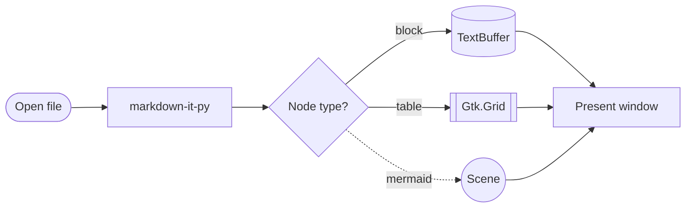
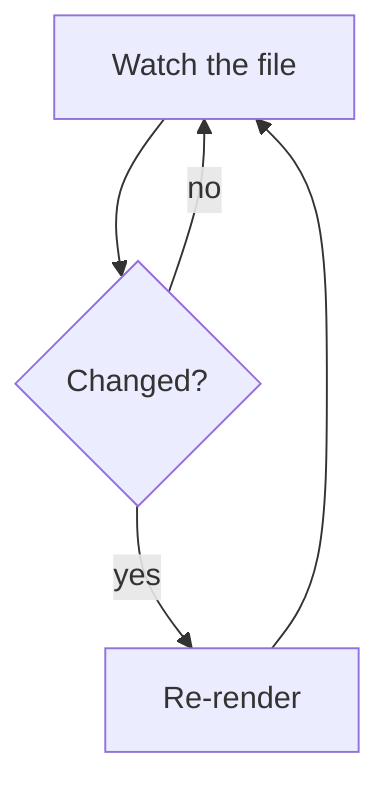
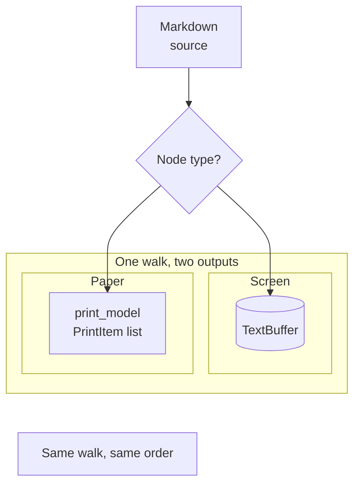
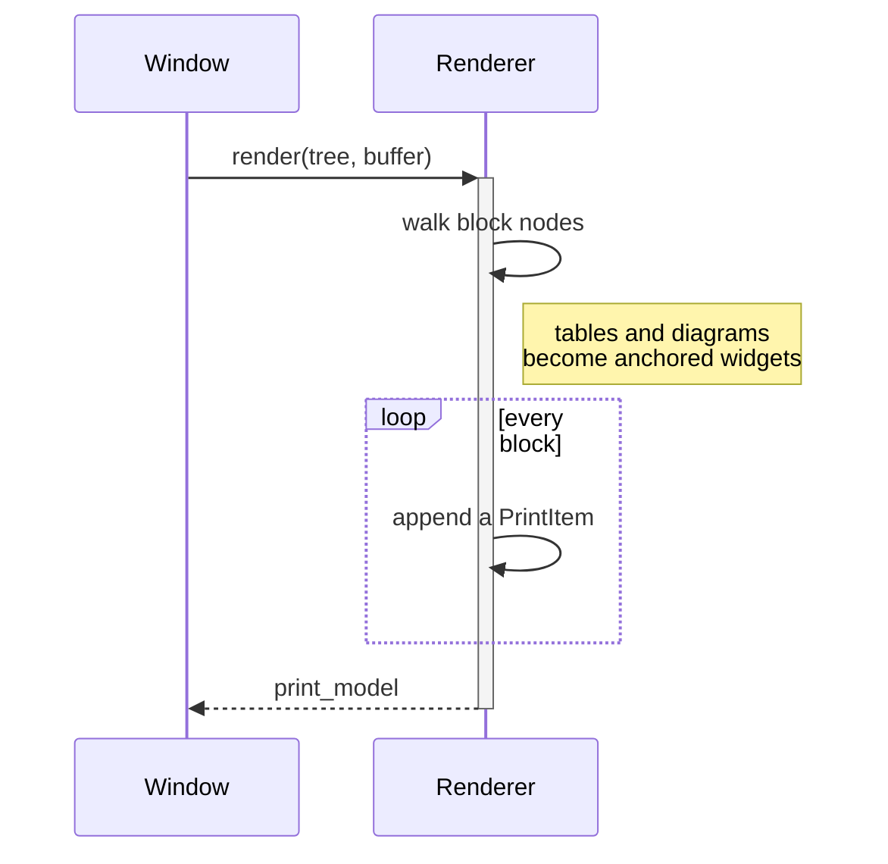
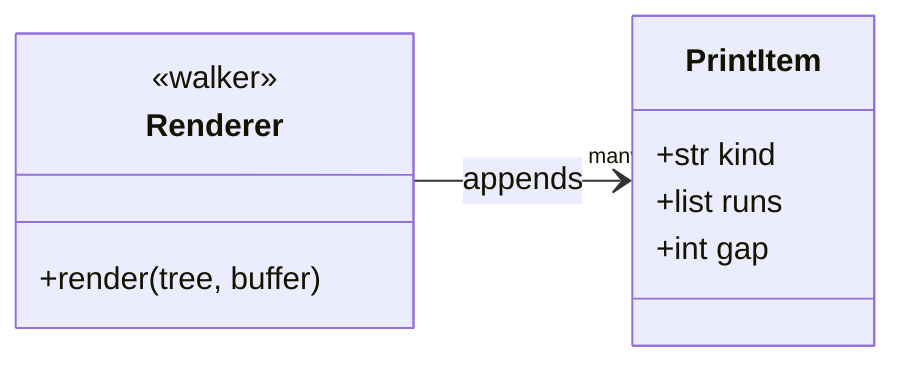
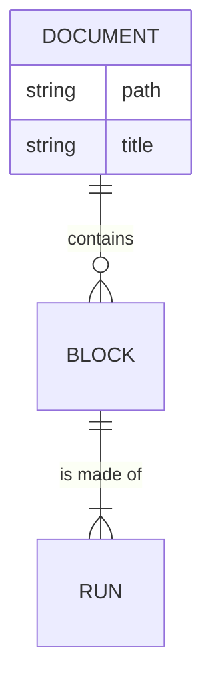
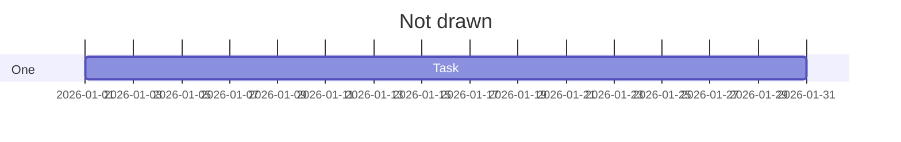

# Lectern kitchen sink

This fixture exercises every feature Lectern v1 is expected to render.

## Headings

### Level three
#### Level four
##### Level five
###### Level six

## Inline formatting

Some **bold text**, some *italic text*, some **bold with *nested italic*
inside it**, ~~strikethrough~~, and `inline code`.

## Lists

- Unordered item one
- Unordered item two
  - Nested unordered item
    - Doubly nested item
- Unordered item three

1. Ordered item one
2. Ordered item two
   1. Nested ordered item
3. Ordered item three

## Task list

- [ ] An unchecked task
- [x] A checked task
- [ ] Another unchecked task

## Blockquote

> This is a blockquote.
> It spans multiple source lines that should join into one paragraph.

## Code

Inline `code()` in a sentence.

```python
def fibonacci(n):
    a, b = 0, 1
    for _ in range(n):
        a, b = b, a + b
    return a


class Example:
    """A docstring."""

    def __init__(self, value):
        self.value = value
```

A fenced block in a language Lectern has never heard of, to exercise the
`guess_lexer` fallback path:

```blorpiscript
frobnicate(x, y) => x <~> y;
```

A long fenced block, deliberately oversized, to exercise print pagination
across multiple pages:

```text
line 01 of a deliberately long code block
line 02 of a deliberately long code block
line 03 of a deliberately long code block
line 04 of a deliberately long code block
line 05 of a deliberately long code block
line 06 of a deliberately long code block
line 07 of a deliberately long code block
line 08 of a deliberately long code block
line 09 of a deliberately long code block
line 10 of a deliberately long code block
line 11 of a deliberately long code block
line 12 of a deliberately long code block
line 13 of a deliberately long code block
line 14 of a deliberately long code block
line 15 of a deliberately long code block
line 16 of a deliberately long code block
line 17 of a deliberately long code block
line 18 of a deliberately long code block
line 19 of a deliberately long code block
line 20 of a deliberately long code block
line 21 of a deliberately long code block
line 22 of a deliberately long code block
line 23 of a deliberately long code block
line 24 of a deliberately long code block
line 25 of a deliberately long code block
line 26 of a deliberately long code block
line 27 of a deliberately long code block
line 28 of a deliberately long code block
line 29 of a deliberately long code block
line 30 of a deliberately long code block
line 31 of a deliberately long code block
line 32 of a deliberately long code block
line 33 of a deliberately long code block
line 34 of a deliberately long code block
line 35 of a deliberately long code block
line 36 of a deliberately long code block
line 37 of a deliberately long code block
line 38 of a deliberately long code block
line 39 of a deliberately long code block
line 40 of a deliberately long code block
line 41 of a deliberately long code block
line 42 of a deliberately long code block
line 43 of a deliberately long code block
line 44 of a deliberately long code block
line 45 of a deliberately long code block
line 46 of a deliberately long code block
line 47 of a deliberately long code block
line 48 of a deliberately long code block
line 49 of a deliberately long code block
line 50 of a deliberately long code block
line 51 of a deliberately long code block
line 52 of a deliberately long code block
line 53 of a deliberately long code block
line 54 of a deliberately long code block
line 55 of a deliberately long code block
line 56 of a deliberately long code block
line 57 of a deliberately long code block
line 58 of a deliberately long code block
line 59 of a deliberately long code block
line 60 of a deliberately long code block
line 61 of a deliberately long code block
line 62 of a deliberately long code block
line 63 of a deliberately long code block
line 64 of a deliberately long code block
line 65 of a deliberately long code block
line 66 of a deliberately long code block
line 67 of a deliberately long code block
line 68 of a deliberately long code block
line 69 of a deliberately long code block
line 70 of a deliberately long code block
line 71 of a deliberately long code block
line 72 of a deliberately long code block
line 73 of a deliberately long code block
line 74 of a deliberately long code block
line 75 of a deliberately long code block
line 76 of a deliberately long code block
line 77 of a deliberately long code block
line 78 of a deliberately long code block
line 79 of a deliberately long code block
line 80 of a deliberately long code block
line 81 of a deliberately long code block
line 82 of a deliberately long code block
line 83 of a deliberately long code block
line 84 of a deliberately long code block
line 85 of a deliberately long code block
line 86 of a deliberately long code block
line 87 of a deliberately long code block
line 88 of a deliberately long code block
line 89 of a deliberately long code block
line 90 of a deliberately long code block
line 91 of a deliberately long code block
line 92 of a deliberately long code block
line 93 of a deliberately long code block
line 94 of a deliberately long code block
line 95 of a deliberately long code block
line 96 of a deliberately long code block
line 97 of a deliberately long code block
line 98 of a deliberately long code block
line 99 of a deliberately long code block
line 100 of a deliberately long code block
```

## Horizontal rule

---

## Table

| Feature      | Supported | Notes                        |
|--------------|-----------|-------------------------------|
| Tables       | Yes       | Column widths sized by median cell length |
| Task lists   | Yes       | Read-only glyphs              |
| Footnotes    | Yes       | Click to jump                 |
| Editing      | No        | This is a viewer              |

## Mermaid diagrams

A `mermaid` fence is drawn rather than listed:



Top-down, with a loop back to an earlier node:



Nested `subgraph` frames, labels broken over two lines with `\n`, and an
invisible `~~~` link placing a node nothing points at:



A sequence diagram, with a frame and a note:



A class diagram and an entity-relationship diagram:





A diagram type this viewer doesn't draw falls back to the code block, so
the source stays readable rather than being silently dropped:



## Links

A regular [link to example.com](https://example.com) and an explicit
autolink <https://example.com/autolink>.

## Images

A local image, resolved relative to this file's own directory:


A small image sits  inline in the text,
rather than alone in its own paragraph. Markdown has no way to ask for a
size, so every image is shown at its own — which is why this one is an
icon rather than the picture above.

## Footnotes

Here is a claim that needs a citation.[^1] Here is a second one.[^2]

[^1]: The first footnote's definition text.
[^2]: The second footnote's definition, with **bold** inside it.
